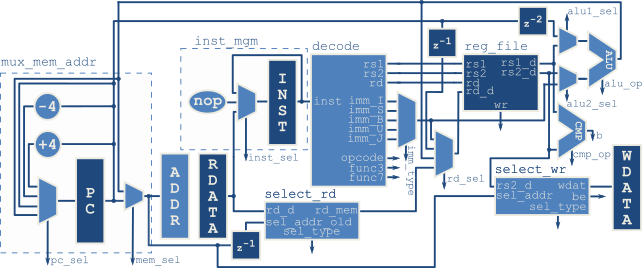

# Rysy Core

Rysy Core is microcontroller core based on subset of RISC-V RV32I ISA (without SYSTEM instruction).



## Simulation in ModelSim

Compile:

```
do scripts/compile.do
```

Run simulation: 
```
do scripts/simulate.do [code/file_with_code.mem]
```

## Hardware

Run on Intel Max10 FPGA. Maximator starter board from Kamami was used.

Resource utilization:
 * Total logic elements: 1560,
 * Total registers: 252,
 * Total memory bits: 10240 (2048 for core, 8192 for RAM),
 * Fmax: 55 MHz.

## Assembler

Code examples assembled with http://rysy_core.gitlab.io/venus/.

